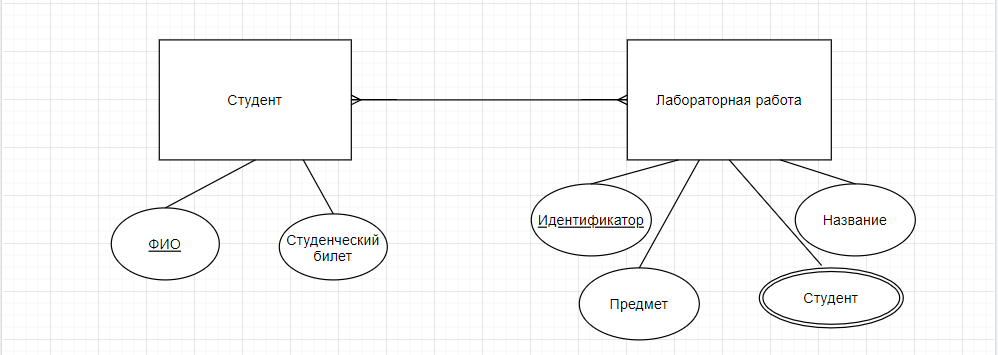
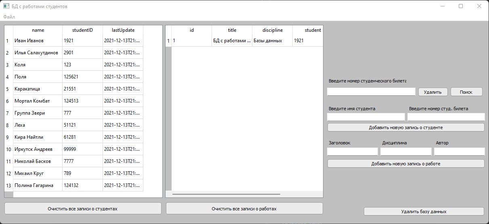

### 1.    Придумать свою предметную область и продумать схему БД для неё.

В качестве предметной области выбрали хранение данных, об студентах и лабораторных работах, выполненых ими. Правая таблица включает в себя ID лабораторной, который генерируется автоматически, название лабораторной, дисциплины и имя студента, который выполнил работу. Левая таблица состоит из двух столбцов: имени студента, а также номера его студенческого билета. 


### 2.    Реализовать реляционную БД для своей предметной области (все таблицы должны быть не менее чем в третьей нормальной форме)

- DONE.

### 3.    Критерии к БД:
1)БД должна быть в третьей нормальной форме или выше;

2)Минимальное количество таблиц – 2;
- База данных состоит из двух таблиц: таблица со студентами и таблица с работами.

3)Все подключения из GUI должны осуществляться выделенным, не root, пользователем;
- мы заранее создали пользователя myuser, который имеет доступ только к созданию базы данных. Подключаюсь к БД по localhost.

4)Должен существовать как минимум один индекс, созданный вами по выбранному текстовому не ключевому полю;
- В качестве индекса студент, выполнивший работу.

```sql
create index if not exists student on "LabWork" (student);
```

5)В одной из таблиц должно присутствовать поле, заполняемое/изменяемое только триггером (например, «общая стоимость бронирования» в таблице «бронирования», которое автоматически высчитывается при добавлении/изменении/удалении билетов, входящих в это бронирование)

- Триггером заполнялось и изменялось поле lastUpdate в таблице издательств. Триггер был объявлен следующим образом: 
```sql
drop trigger if exists trigger_update on "Student";

create trigger trigger_update before update on "Student" 
    for row execute procedure update_time();
```

### 4.    Реализовать программу GUI со следующим функционалом:

1)Создание базы данных (важно(!) именно create database, а не только create table)

2)Удаление базы данных

3)Вывод содержимого таблиц

4)Очистка(частичная - одной, и полная - всех) таблиц

5)Добавление новых данных

6)Поиск по заранее выбранному (вами) текстовому не ключевому полю

7)Обновление кортежа

8)Удаление по заранее выбранному текстовому не ключевому полю

9)Удаление конкретной записи, выбранной пользователем

10)Все функции должны быть реализованы как хранимые процедуры. 

 - Из GUI вызываются только хранимые функции. 
 
 ### 5. Структура проекта: 
 
 - commands.sql (здесь хранятся хранимые функции)
 - design.py (код дизайна основного окна)
 - design.ui (код дизайна основного окна)
 - database.py (класс в бд, подключение к ней и вызов хранимых функций)
 - gui.ui (реализация гуи)
 - main.py (запуск проекта)
 - config.py (переменные названия бд, пользователя, порта и тд.)
 
 ### 6. Вид приложения:


Основное окно 



### 7. Демонтрация работы: 

